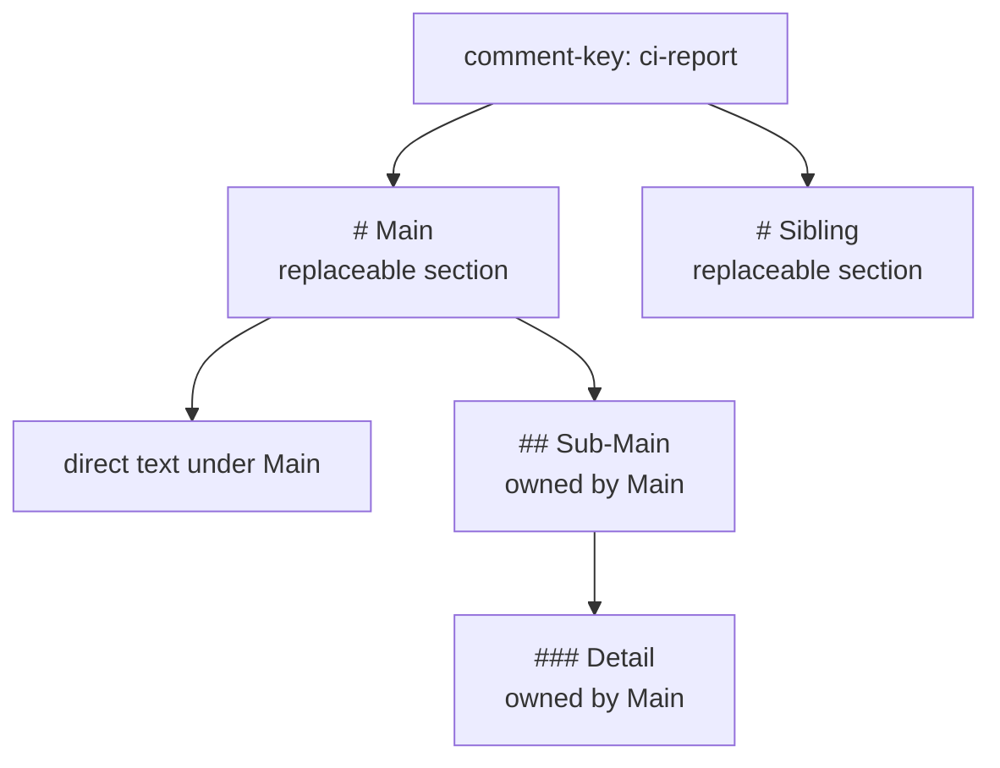
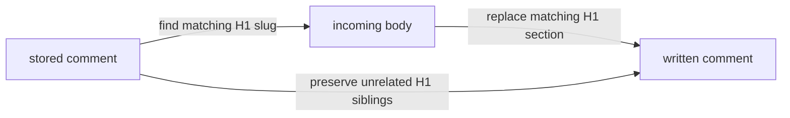
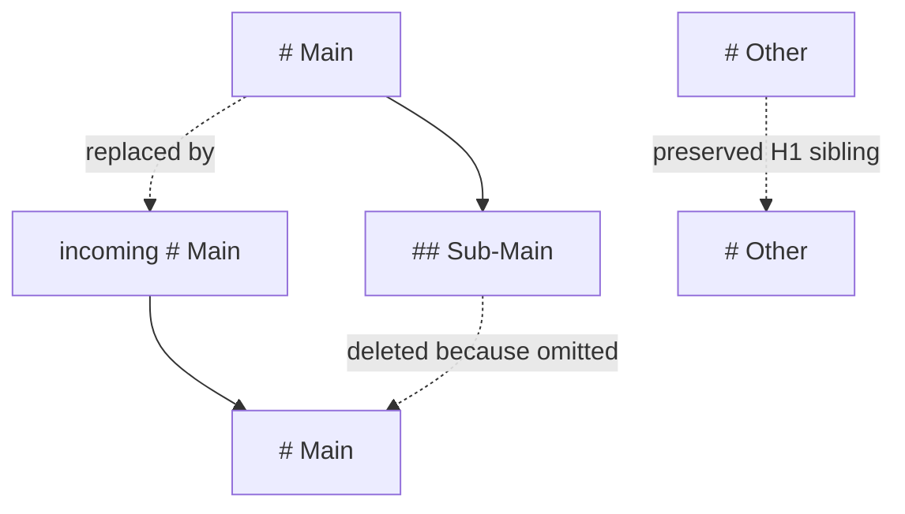
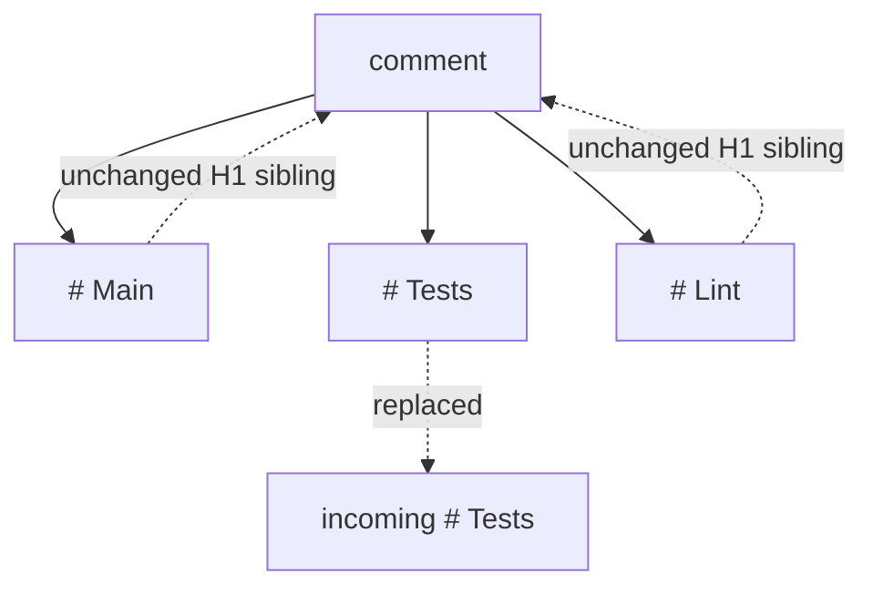

# Section Hierarchy

Remark treats generated comments as top-level Markdown sections. Hidden HTML comments identify the generated comment and
each replaceable H1 section.

The key rule is:

> Updating an H1 heading replaces that H1 and all Markdown below it until the next H1.

That means an H1 parent may delete nested H2+ headings by omitting them from the replacement body.

## Terms

| Term        | Meaning                                                                                 |
| ----------- | --------------------------------------------------------------------------------------- |
| Comment     | The whole PR comment identified by `comment-key`.                                       |
| Root marker | Hidden marker that identifies the generated comment, for example `<!-- remark:ci -->`.  |
| H1 section  | A `# Heading`, its direct body text, and all nested H2+ content below it.               |
| Nested text | Any content under an H1 before the next H1, including `##`, `###`, and deeper headings. |
| Sibling     | Another H1 section in the same generated comment.                                       |

## Heading Ownership

Only H1 headings are independently replaceable. Lower-level headings belong to the nearest previous H1.



In Markdown:

```markdown
# Main

Direct text under Main.

## Sub-Main

Nested text.

### Detail

More nested text.

# Sibling

Independent top-level section.
```

The logical ownership is:

```text
comment
+-- # Main
|   +-- direct text under Main
|   +-- ## Sub-Main
|       +-- ### Detail
+-- # Sibling
```

## Marker Shape

Remark uses hidden HTML comments for machine-readable boundaries. The root marker identifies the generated comment. Each
H1 section has an opening and closing section marker.

When searching for an existing comment, Remark requires a valid generated comment shape and an author it recognizes as
its own. When the `github-token` can read its own login (for example a personal access token), the comment author must
match that login. The default Actions `GITHUB_TOKEN` is an installation token whose login cannot be read -- `GET /user`
returns HTTP 403 -- so Remark then accepts any Bot author with the generated shape. A human user comment that merely
contains a matching marker is ignored in both cases.

```markdown
<!-- remark:ci-report -->
<!-- section:main -->

# Main

Direct text under Main.

## Sub-Main

Nested text.

<!-- /section:main -->
<!-- section:sibling -->

# Sibling

Independent top-level section.

<!-- /section:sibling -->

_Last updated: 2024-06-18 14:32 UTC - Generated by Remark_
```

Lower-level headings do not get their own stored section markers. They are preserved, replaced, or deleted together with
their owning H1 section.

## Replacement Rule

When Remark receives new Markdown, each incoming H1 is matched against the stored H1 sections. The matched stored H1
section is replaced by the incoming H1 section.

Replacement happens at H1 section boundaries:

- Replacing `# Main` replaces `# Main`, its direct text, and all nested `##` and deeper headings below it.
- Sibling H1 sections outside the replaced section are preserved.
- Nested headings omitted from the replacement H1 are deleted.
- A body with no H1 headings replaces the whole generated comment body.



## Parent Update Deletes Children

Initial stored comment:

```markdown
# Main

Old main text.

## Sub-Main

Old nested text.

# Other

Keep me.
```

Incoming update:

```markdown
# Main

New main text.
```

Result:

```markdown
# Main

New main text.

# Other

Keep me.
```

`## Sub-Main` is removed because it belonged to `# Main`, and the incoming replacement for `# Main` did not include that
nested heading.



## Parent Update Keeps Included Children

Initial stored comment:

```markdown
# Main

Old main text.

## Sub-Main

Old nested text.
```

Incoming update:

```markdown
# Main

New main text.

## Sub-Main

New nested text.
```

Result:

```markdown
# Main

New main text.

## Sub-Main

New nested text.
```

Because the replacement for `# Main` includes `## Sub-Main`, the nested heading remains with the incoming content.

## Siblings Are Preserved

A replacement does not remove H1 sections outside the replaced H1.



If only `# Tests` is updated, `# Main` and `# Lint` remain in the comment.

## Practical Guidance

Use one H1 heading for each independently owned report area:

```markdown
# Tests

...

# Lint

...

# Preview

...
```

Use nested headings for information that belongs to the parent report and may be deleted when the parent report is
rewritten:

```markdown
# Tests

Overall status.

## Failed Jobs

Details that should disappear when there are no failed jobs.
```

If content should survive independently from another report area, make it a sibling H1 section instead of a nested
heading.

For generated reports, prefer `body-file` over embedding long Markdown in workflow YAML:

```yaml
- run: npm test -- --reporter markdown > report.md

- uses: goeselt/remark@v1
  with:
    comment-key: test-report
    body-file: report.md
```

`body-file` must be a relative path to a regular file inside `GITHUB_WORKSPACE`. Absolute paths, path traversal, symlink
escapes, directories, and files larger than the comment body limit are rejected before the file is read.

## Reserved Markers

The following marker prefixes are reserved for Remark and are rejected in incoming `body` input:

- `<!-- remark:`
- `<!-- section:`
- `<!-- /section:`

This prevents generated comment boundaries from being injected by untrusted Markdown.

Remark rejects its own marker syntax, but it does not sanitize general Markdown. Treat reports generated from untrusted
pull request content as user-controlled Markdown.

## Parallel Updates

Remark performs a read-merge-write update. If two jobs update the same `comment-key` at the same time, the later write
can overwrite the earlier write's merge result.

`skip-unchanged: true` can reduce unnecessary writes when the merged content is identical. It ignores Remark's generated
timestamp footer during comparison, but it is not a concurrency lock.

Use workflow-level concurrency when multiple jobs write to the same generated comment:

```yaml
concurrency:
  group: remark-${{ github.event.pull_request.number }}
  cancel-in-progress: false
```

Independent comments with different `comment-key` values do not share this merge state.

## Pull Request Number

In `pull_request` workflows and PR `issue_comment` workflows, Remark infers the pull request number from the event
payload. Set `pr-number` only when the event does not identify a PR, such as `workflow_dispatch` or `push`.
